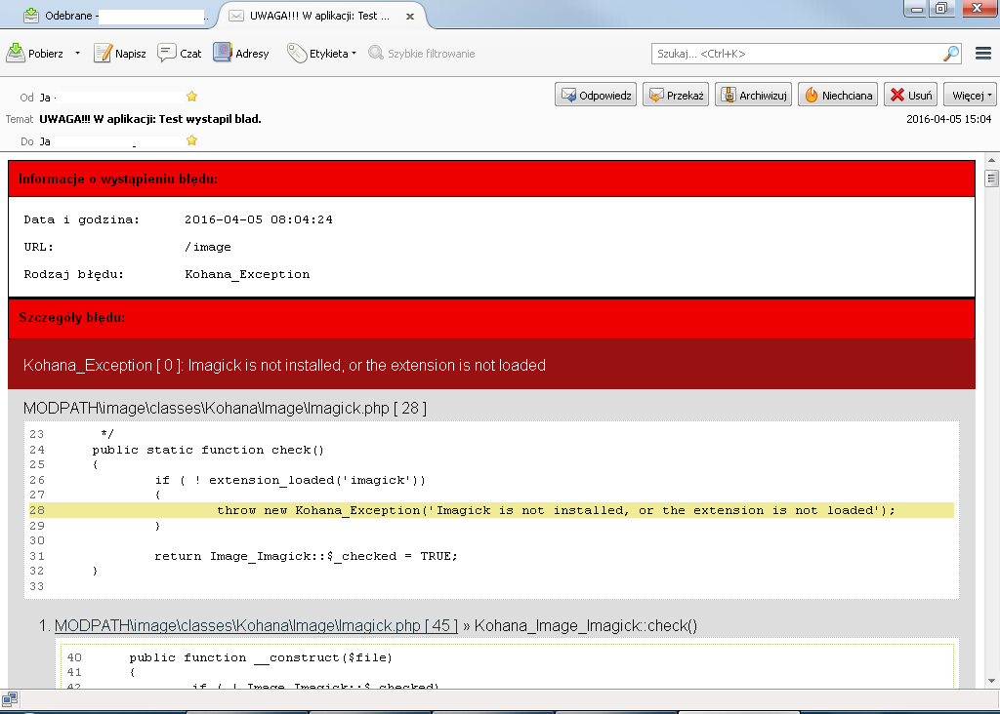

# Kohana Exception E-mail Reporting System

This extension can be used to automatically reporting errors if they occur in
your Web application. The report will allow you to speed up work on the possible
improvement of errors and quicker to detect them. Just copy the files to the
appropriate directories in your application.

## File and directory structure

```
application
  classes
    Kohana
      Exception.php
  config
    email.php
  views
    template
      email
        error.php
    error
      default.php
  vendor
    swiftmailer
  system
    classes
      Email.php
      Kohana
        Email.php
```

## Requirements

You must install Swiftmailer on vendor directory.

http://swiftmailer.org/

Your application must be in a production environment. In your bootstrap.php you
have enabled errors

```php
Kohana::init(array(
	'base_url'   => '/',
        'index_file' => false,
        'cache_dir'  => APPPATH . 'cache',
        'cache_life' => 60,
        'errors'     => true,
        'profile'    => Kohana::$environment !== Kohana::PRODUCTION,
        'caching'    => Kohana::$environment === Kohana::PRODUCTION,
));

```

## Example Thunderbird Inbox Screen





